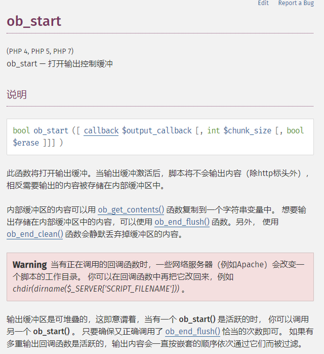

# 攻击系统资源

针对流量的DDoS攻击为什么通用使用UDP协议？那是因为 UDP面向无连接，双方无需验证对方身份即可传输。而且 UDP协议有更高的传输效率。

如何使用TCP来进行的DDoS攻击呢？

## 攻击系统资源

> 系统资源的攻击在0SI七层模型中发生在操作系统层面，最终可能会发现系统网络带宽正常，但是系统无法正常提供服务。

攻击系统资源有以下两种常见方式： 

* 攻击TCP连接 ：SYN Flood 攻击；ACK Flood攻击 ；Sockstress攻击 
* 攻击SSL连接 ：THCSSL DOS攻击 ；SSL洪水攻击

### TCP攻击

#### SYN Flood攻击

在理解SYN Flood攻击原理前，先回顾一下TCP的三次握手的过程

TCP的3次握手，通信的双方最少得经过3次成功的信息交换才能进入连接全开状态（Full-Open），也就是我常说的建立TCP连接的3次握手（TCP three-way handshake）。

SYN FLOOD攻击就是攻击者利用TCP三次握手的漏洞，受控主机伪造源IP发送大量的TCP  SYN报文，使服务器打开大量的半开连接，占满服务器的连接表，从而影响正常用户与服务器建立会话，造成拒绝服务。  

#### ACK Flood 攻击

攻击者伪造大量的SYN+ACK包发送给目标主机，目标主机每收到一个SYN+ACK数据包时，都会去自己的TCP连接表中查看有没有与ACK的发送者建立连接，如果有则发送ACK包完成TCP连接，如果没有则发送ACK+RST断开连接。

在服务器查询过程中会消耗一定的CUP计算资源。如果瞬间收到大量的SYN+ACK数据包，将会消耗服务器的大量cpu资源，导致正常的连接无法建立或增加延迟，甚至造成服务器瘫痪、死机。

#### Sockstress攻击

> SockStress攻击正好与Syn Flood攻击原理相悖，它正是利用建立TCP/IP三次握手连接来实现拒绝服务攻击。
>
>  SockStress不同于洪水攻击，并非以量取胜，而是以慢取胜，是一种慢速攻击。

Sockstress攻击首先会完成TCP三次握手以建立TCP连接，但是在三次握手的最后一次ACK应答中，攻击者将其TCP窗口大小设置为0，随后进行数据请求，攻击目标在传输数据时，发现接收端的TCP窗口大小为0，就会停止传输数据，并发出TCP窗口探测包，询问攻击者其TCP窗口是否有更新，由于攻击者不会更改TCP窗口的大小，被攻击目标就会一直维持等待数据发送，并不断进行窗口更新的探测状态。

### SSL链接攻击

> SSL（Secure Sockets Layer 安全套接层），是为网络通信提供安全及数据完整性的一种安全协议，SSL能够在传输层对网络连接进行加密，以防止传输的数据明文被监听和截获。 
>
> SSL最典型的应用是在HTTPS协议中，传统HTTP协议因明文传输非常容易被截获。

SSL协议加密、解密和秘钥协商的过程中会消耗大量的系统资源，严重降低机器的性能，因此，通常只有在传输密码等机密信息时才使用SSL协议进行传输。 攻击者利用SSL协议消耗资源的特性进行拒绝服务攻击。

#### THC SSL DOS 

在进行SSL数据传输之前，通信双方首先要进行SSL握手，以协商加密算法交换加密秘钥，进行身份验证，但是在SSL协议中有一个Renegotiation选项，通过它可以进行秘钥的重新协商以建立新的秘钥。 

THC SSLDOS攻击在进行SSL连接并握手之后，**攻击者反复不断的进行秘钥重新协商过程，而秘钥重新协商过程需要服务器投入比客户端多15倍的CPU计算资源**，以此来使服务器忙于协商秘钥而完全停止响应。

#### SSL Flood

> 若服务器不支持Renegotiation重协商密钥，攻击者只能发起大量SSL连接，以此达到密钥协商消耗资源的目的。这种发起大量SSL连接的攻击方式就是SSL Flood。

SSL Flood，建议是在数据传输之前，进行SSL握手的过程中发动攻击，攻击者并不需要完成SSL握手和秘钥交换，而只需要在这个过程中让服务器去解密和验证，就能够大量的消耗服务器的计算资源。

